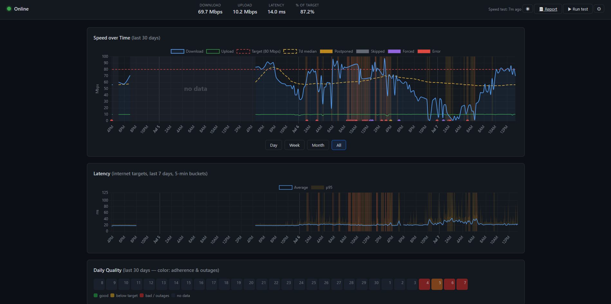
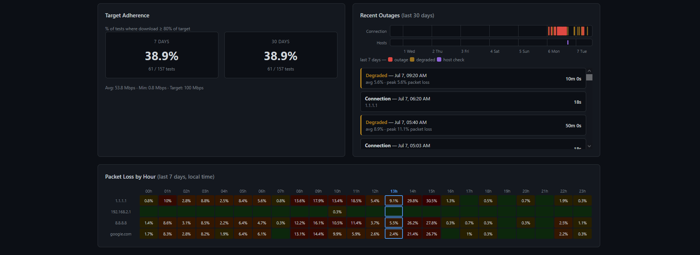

# LineProof

**Your ISP promised a speed. LineProof collects the receipts.**

A self-hosted internet connection monitor that runs 24/7 on a home machine,
measures what your line actually delivers, and turns months of data into a
bilingual, print-ready evidence report you can hand to your provider.

[](https://github.com/ApolloEs/LineProof/actions/workflows/ci.yml)





## Why

Built after paying for 100 Mbps and measuring ~20 — even at 3 AM. Speedtest
screenshots are easy to dismiss; a continuous, methodologically fair dataset
with outage logs and packet-loss records is not.

## What it does

- **Two-layer monitoring**
  - *Connectivity layer*: ICMP probes to anchor hosts (Cloudflare, Google,
    your gateway, optional hostnames for DNS checks) every few seconds —
    detects outages, packet loss, and latency at near-zero bandwidth cost.
  - *Speed layer*: full download/upload/latency measurements via the official
    Ookla Speedtest CLI on a configurable interval.
- **Fair measurements** — speed tests are automatically postponed while the
  line is in use, so results reflect an idle connection (and can't be blamed
  on your own downloads).
- **Outage & degraded-period detection** — sustained drops become outage
  records with durations; periods of sustained packet loss ("up but
  unusable") are detected and persisted separately.
- **Live dashboard** — speed-over-time with outage/degraded bands and no-data
  gaps, latency chart, packet-loss-by-hour heatmap, daily quality calendar,
  outage timeline, target-adherence rollups. Real-time updates over SSE,
  light/dark theme, mobile-friendly.
- **In-dashboard control** — edit monitoring settings (validated, comment-
  preserving), restart monitoring, or force a speed test without touching a
  terminal.
- **Evidence report** — one click renders a self-contained HTML report
  (Greek/English toggle, print-to-PDF): median vs. contracted speed,
  percentiles, peak vs. off-peak comparison, outage log, degraded time,
  packet loss, and a methodology section. Safe to email — everything is
  inlined.
- **Data-cost aware** — real bytes per test are recorded; the settings panel
  projects data usage per day for your current cadence.
- **Set-and-forget deployment** — Docker Compose stack, Windows service
  via NSSM (downloaded and checksum-verified at install), systemd unit
  prepared for Raspberry Pi.

## Run with Docker

The fastest way to try LineProof — Postgres and the Ookla CLI included, no
local Python needed:

```bash
git clone https://github.com/ApolloEs/LineProof.git
cd LineProof
cp config.docker.yaml config.yaml    # then edit target_mbps to your plan
docker compose up -d
```

Dashboard: <http://localhost:5000>. Tables are created automatically on
first start; data lives in a named volume (`lineproof-data`) and survives
`docker compose down`.

Worth knowing:

- Inside the compose network the database host is `postgres` and the
  dashboard binds `0.0.0.0` — both preset in `config.docker.yaml`.
  Anyone who can reach the published port can also change settings, so
  keep it on localhost/LAN or put a reverse proxy with auth in front.
- Unprivileged ICMP needs the `net.ipv4.ping_group_range` sysctl, which
  the compose file sets per-container. If your runtime disallows that,
  run the service privileged instead.
- The `gateway` ping target is omitted: a container's gateway is Docker's
  bridge, not your router.
- On Docker Desktop (Windows/macOS) speed tests pay VM networking
  overhead — fine for trying it out; for evidence-grade numbers run
  natively or on a Linux host.

## Quick start

Prerequisites: Python 3.10+, PostgreSQL, and the
[Ookla Speedtest CLI](https://www.speedtest.net/apps/cli).

```bash
git clone https://github.com/ApolloEs/LineProof.git
cd LineProof
pip install -r requirements.txt

cp config.example.yaml config.yaml     # then edit: target speed, DB URL, CLI path

# Create the database role + database (once; needs Postgres admin access):
python scripts/setup_db.py

python -m netmon.main                  # start monitoring + dashboard
```

`setup_db.py` reads your `config.yaml` and creates the matching role and
database (idempotently) via an admin connection — pass one with
`--admin-url` if the default local-superuser connection doesn't work.
Prefer doing it by hand? The equivalent SQL is:
`CREATE USER netmon WITH PASSWORD '...'; CREATE DATABASE netmon OWNER netmon;`

Tables are created and migrated automatically at startup
(`scripts/init_db.py` remains for creating them explicitly).

Dashboard: <http://127.0.0.1:5000> · Evidence report: the **📄 Report**
button, or `python scripts/generate_report.py --days 30`.

## Run it as a service

- **Windows**: [`deploy/windows/`](deploy/windows/README.md) — install script
  (fetches and checksum-verifies NSSM), graceful stop, crash restart.
- **Raspberry Pi / Linux**: [`deploy/pi/`](deploy/pi/README.md) — systemd
  unit and migration checklist.

## Configuration

Everything lives in `config.yaml` (see
[`config.example.yaml`](config.example.yaml)). Highlights:

| Key | Meaning |
|---|---|
| `target_mbps` | The speed your contract promises — every stat is relative to this |
| `speed_test.interval_hours` | Cadence of full speed tests (mind the data cost) |
| `speed_test.soft/hard_threshold` | Postpone/skip tests when the line is already in use |
| `connectivity.ping_interval_seconds` | Probe cadence (outage detection resolution) |
| `connectivity.degraded_loss_threshold_pct` | Packet-loss level that counts as "degraded" |
| `report.*` | Optional identity lines printed on the evidence report |

Monitoring-related settings are also editable from the dashboard's ⚙ panel,
with live restart — no service interruption.

## How it's built

Python · PostgreSQL · APScheduler · Flask + waitress · Chart.js (vendored —
the dashboard keeps working *during* outages). Raw pings are kept 7 days
(aggregates and detected periods are kept forever), so the database stays
small indefinitely.

See [`docs/DESIGN.md`](docs/DESIGN.md) for the original design document,
[`docs/ARCHITECTURE.md`](docs/ARCHITECTURE.md) for the as-built data flow,
and [`KNOWN_ISSUES.md`](KNOWN_ISSUES.md) for the honest list of rough edges.

## Security / trust model

The dashboard has **no authentication** — by design, for a single-user
tool on a home machine. The default bind is `127.0.0.1`, which keeps it
local. If you bind to a LAN address or run the Docker stack (which
publishes the port), anyone with network access can view your data,
**change monitoring settings, and trigger restarts**. If that matters on
your network, put it behind a reverse proxy with authentication; don't
expose it to the internet as-is.

## Roadmap

Raspberry Pi migration (always-on, low-power) · outage alerts (Discord) ·
weekly email digest · per-hour speed targets.

## License

[MIT](LICENSE)
