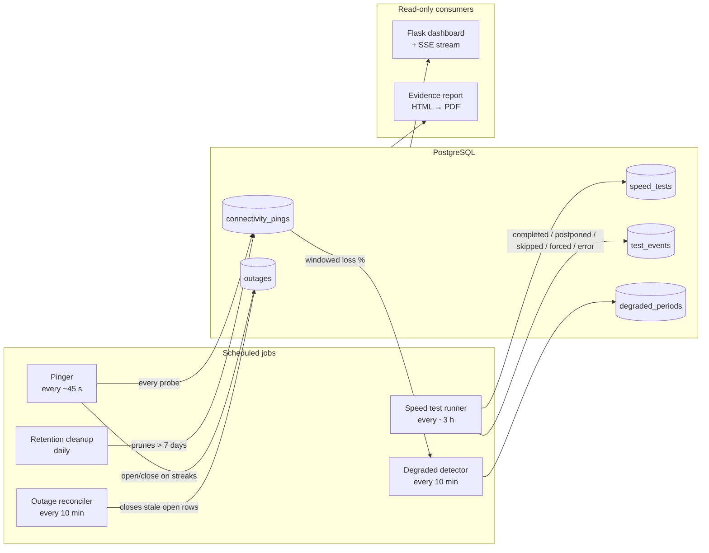

# NetMon Architecture

One long-running Python process (plus PostgreSQL). An APScheduler
`BlockingScheduler` drives all periodic work; a waitress-served Flask
app runs in a daemon thread of the same process, so the dashboard can
reach in and reschedule jobs ("restart monitoring", "run test now")
without any IPC.

## Data flow

Writers never overlap: the pinger owns `connectivity_pings` and live
outage rows, the speed-test runner owns `speed_tests`/`test_events`,
the degraded detector owns `degraded_periods`. The reconciler is the
one deliberate exception — it closes outage rows the pinger left open
when the process died mid-outage (and only on confirmed recovery or
provably stale data). The dashboard and report are strictly read-only;
display-time concerns like merging per-target outages into "connection
events" happen at query time in `queries.py`, never by rewriting rows.

## Retention

Raw pings are the only unbounded-growth table, so `cleanup.py` prunes
`connectivity_pings` older than 7 days once a day. Everything derived —
outages, degraded periods, speed tests, test events — is small
(rows per event, not per probe) and is kept forever, because long-term
evidence is the point of the project. Net effect: the database stays at
a roughly constant size no matter how long NetMon runs. The degraded
detector is restart-safe within that window: it resumes from
`started_at + windows_count × window` and backfills the full retention
window on first run.

## SSE event flow

`events.py` is a tiny in-process pub/sub hub. After each run, the job
wrappers in `jobs.py` publish typed events — `status_update` (every ping
cycle, includes `test_running`), `speed_update` and `speed_test_done`
(after a speed test), `degraded_update` (when a degraded period opens or
closes). The Flask route `/api/stream` parks one waitress thread per
connected browser on a subscriber queue and relays events as
server-sent events; the frontend updates charts, the status strip, and
the tab title/favicon without polling. Waitress runs 8 threads, which
bounds concurrent SSE clients; a subscriber-count guard before the
status query is a known deferred optimization (see KNOWN_ISSUES.md).
